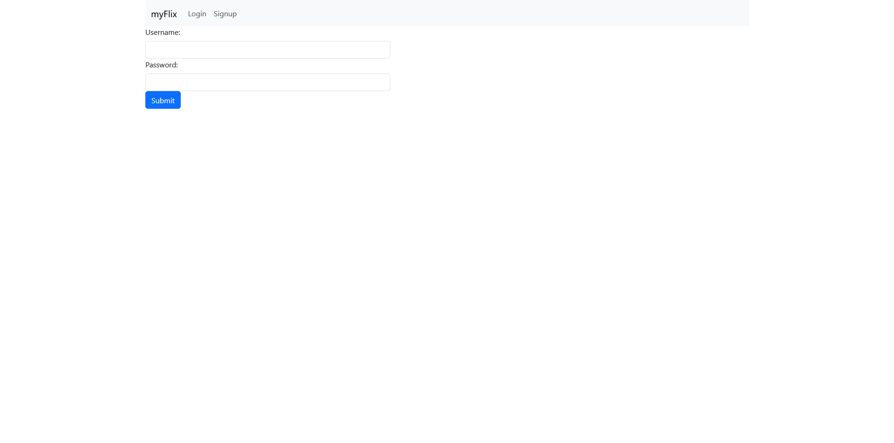
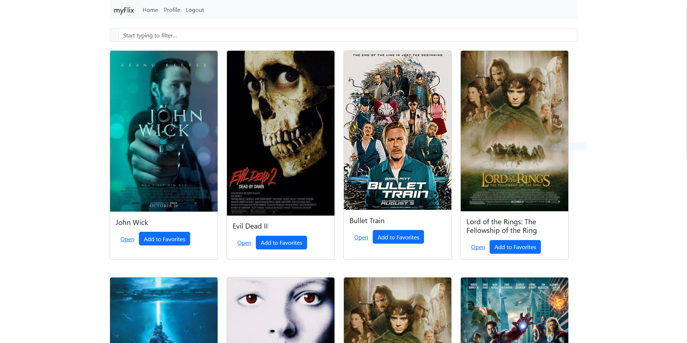
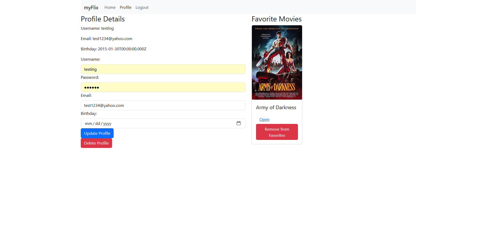

# myFlix Client-Side App

# Overview

This project will be a client for my other myFlix server project.
myFlix uses an API I made a few months ago, consisting of a database with movies, genres, directors, and users.

# Project Goals

Create a one-page application that allows its users to:

- Register and create a user profile
- View a list of movies from the API database
- View details about a movie, its director and genre
- Add movies to a personal favorites list
- Remove movies from the same favorites list
- Update user information from the profile page
- Delete their profile

# Technical Requirements

- Application runs on a single page
- Application uses state routing to navigate views and share URLs
- Application includes a filter/search bar that allows users to look for specific movies
- Application uses Parcel as a build tool
- Application was written with the React library and in ES2023
- Application uses Bootstrap as a UI library fr styling and responsiveness
- Application contains function components
- Application is hosted online

# Screenshots of Working myFlix App

